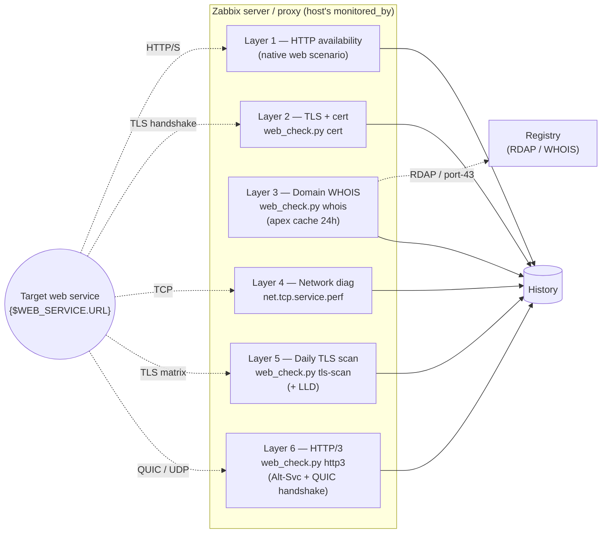

# zabbix-webservices

> 🇬🇧 [Read in English](README_EN.md)

Шаблон Zabbix 7.0 и внешний скрипт для мониторинга веб-сервисов
(доступность HTTP/HTTPS, TLS-сертификат, WHOIS домена, сетевая
диагностика, ежедневное TLS-сканирование) — сопровождается
компанией [IT for Prof](https://itforprof.com).

## Архитектура



Все проверки запускаются с того узла Zabbix (сервер или прокси),
который уже мониторит хост, — egress запросов совпадает с egress
остального мониторинга хоста (важно для сценариев GEO / RKN /
внутреннего DNS).

## Что внутри

| Путь | Назначение |
|------|------------|
| [`templates/web-service-by-itforprof/`](templates/web-service-by-itforprof/) | Шаблон Zabbix `Web service by itforprof.com` (6 слоёв, один шаблон на хост). |
| [`scripts/externalscripts/web_check.py`](scripts/externalscripts/web_check.py) | Внешний скрипт (`cert`/`whois`/`tls-scan`/`discover-tls`/`self-test`). |
| [`scripts/deploy/`](scripts/deploy/) | `install.sh` (однострочник) + закреплённый `requirements.lock` для развёртывания в `/opt/web_check/venv`. |
| [`scripts/migrate-from-itmicus.py`](scripts/migrate-from-itmicus.py) | Идемпотентная миграция с устаревшего `Template Website metrics (itmicus.ru)`. |
| [`docs/`](docs/) | Архитектура, матрица валидации, чек-лист миграции. |

## Быстрое развёртывание (на каждом мониторинговом узле)

```
curl -fsSL https://raw.githubusercontent.com/IT-for-Prof/zabbix-webservices/main/scripts/deploy/install.sh | sudo sh
```

Альтернатива через `wget` (если на ноде нет `curl`):
```
wget -qO- https://raw.githubusercontent.com/IT-for-Prof/zabbix-webservices/main/scripts/deploy/install.sh | sudo sh
```

Всё, что нужно скрипту, он скачивает из этого же GitHub-репозитория
(сам `install.sh`, потом `requirements.lock` и `web_check.py` под пином
`$REF`). Локальный `git clone` не требуется.

Что делает скрипт (требует root, идемпотентен — повторный запуск обновляет):
1. ставит `uv` (Astral, single-binary) если его нет;
2. разворачивает изолированный Python 3.12 в `/opt/web_check/python/` —
   зависимости системного Python не трогаются;
3. создаёт venv в `/opt/web_check/venv/` с pinned-зависимостями из
   [`scripts/deploy/requirements.lock`](scripts/deploy/requirements.lock);
4. кладёт `web_check.py` в `/usr/lib/zabbix/externalscripts/` (владелец
   `zabbix:zabbix`, режим `0750`);
5. создаёт каталог кэша `/opt/web_check/data/cache/`;
6. прогоняет `web_check.py self-test` как smoke-проверку.

Закрепить за конкретным релизом (рекомендуется в проде) — заменить `main`
на тег или SHA:
```
curl -fsSL https://raw.githubusercontent.com/IT-for-Prof/zabbix-webservices/<TAG_OR_SHA>/scripts/deploy/install.sh | sudo REF=<TAG_OR_SHA> sh
```

Проверить вручную в любой момент:
```
sudo -u zabbix /usr/lib/zabbix/externalscripts/web_check.py self-test
sudo -u zabbix /usr/lib/zabbix/externalscripts/web_check.py --version
```

После этого импортируйте YAML шаблона в интерфейсе Zabbix
(Configuration → Templates → Import) либо через API
(`configuration.import`). Шаблон лежит в
[`templates/web-service-by-itforprof/`](templates/web-service-by-itforprof/).

## Требования

- Zabbix server / proxy 7.0+; агенты не нужны (шаблон использует Web
  Scenarios, Simple Checks и EXTERNAL items — всё со стороны
  сервера/прокси).
- `curl`, `sudo` и доступ в интернет на каждой ноде на момент установки
  (нужны для `uv`, pinned-зависимостей и GitHub raw). После установки
  скрипт работает офлайн (PSL-snapshot из tldextract).
- Python на хосте не требуется — `uv` ставит свой собственный 3.12 в
  `/opt/web_check/python/`.


## Версионирование

Каждый шаблон содержит `vendor: { name: itforprof.com, version: <zabbix-major>-<semver> }`,
сейчас `7.0-2.2.2`. Правила увеличения версии:

- patch (`2.2.0` → `2.2.1`) — исправление ошибок, без изменений схемы items/triggers
- minor (`2.2.0` → `2.3.0`) — новые items/triggers, обратно совместимо
- major (`2.2.0` → `3.0.0`) — несовместимые изменения макросов/items, нужна миграция

## Автор

**Константин Тютюнник** (Konstantin Tyutyunnik) — [itforprof.com](https://itforprof.com)

## Благодарности

Оригинальная работа автора. Заменяет концептуально близкий шаблон Zabbix
[`Template Website metrics (itmicus.ru)`](https://github.com/itmicus/zabbix/tree/master/Template%20Web%20Site)
от **itmicus** — тот шаблон задал предметную область (мониторинг
доступности HTTP + TLS-сертификат + срок регистрации домена), а здесь
она переписана с нуля на нативных средствах Zabbix 7.0 + один современный
Python-внешний скрипт. **Код не копировался**; именование макросов
itmicus (`{$WEBSITE_METRICS_URL/PHRASE/TIMEOUT}`) сохранено в
[`scripts/migrate-from-itmicus.py`](scripts/migrate-from-itmicus.py)
исключительно для бесшовной миграции существующих хостов.

## Миграция с itmicus

Существующие инсталляции Zabbix с `Template Website metrics (itmicus.ru)`
переезжают на новый шаблон одним **идемпотентным скриптом**:

```
scripts/migrate-from-itmicus.py --list        # сухой запуск: список хостов
scripts/migrate-from-itmicus.py --apply --keep-old   # привязать новый, оставить старый
# подождать параллельный прогон / валидацию
scripts/migrate-from-itmicus.py --apply       # отвязать старый
```

Подробный план поэтапного развёртывания (пилот → тенанты → очистка) —
в [`docs/migration-checklist.md`](docs/migration-checklist.md);
архитектурный контекст — в [`docs/architecture.md`](docs/architecture.md)
§"Migration plan".

## Лицензия

MIT — см. [LICENSE](LICENSE). Copyright © 2025-2026 Константин Тютюнник.
