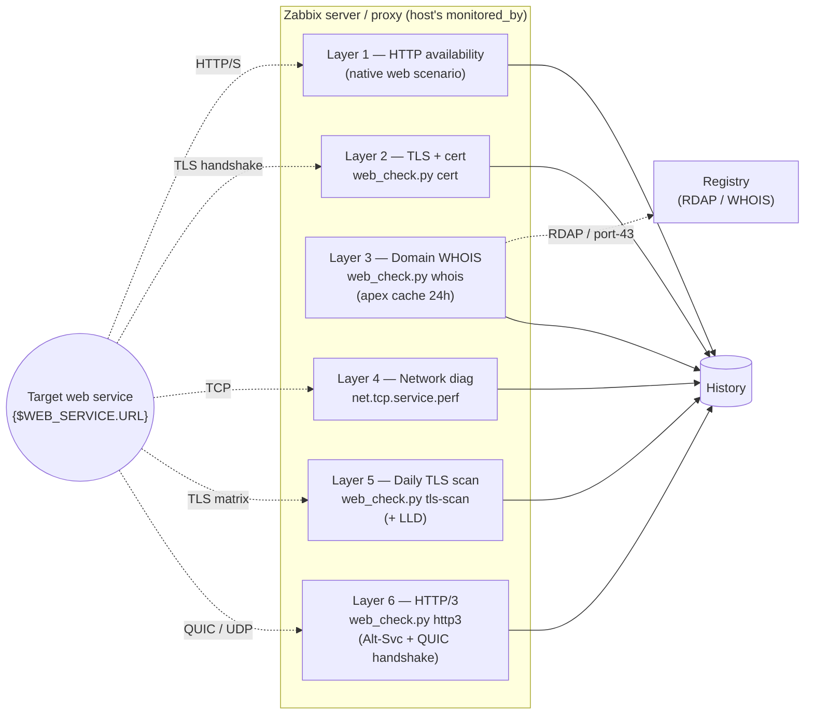

# zabbix-webservices

> 🇷🇺 [Читать на русском](README.md)

Zabbix 7.0 template and externalscript for monitoring web services
(HTTP/HTTPS availability, TLS certificate, domain WHOIS, network
diagnostics, daily TLS scan) — maintained by
[IT for Prof](https://itforprof.com).

## Architecture



All checks run from the Zabbix node that already monitors the host (server
or proxy), so request egress matches the rest of the host's monitoring —
important for GEO / RKN / internal-DNS scenarios.

## What's inside

| Path | Purpose |
|------|---------|
| [`templates/web-service-by-itforprof/`](templates/web-service-by-itforprof/) | `Web service by itforprof.com` Zabbix template (6-layer, single template per host). |
| [`scripts/externalscripts/web_check.py`](scripts/externalscripts/web_check.py) | Single-file externalscript (`cert`/`whois`/`tls-scan`/`discover-tls`/`self-test`). |
| [`scripts/deploy/`](scripts/deploy/) | `install.sh` one-liner + pinned `requirements.lock` for the `/opt/web_check/venv` deploy. |
| [`scripts/migrate-from-itmicus.py`](scripts/migrate-from-itmicus.py) | Idempotent migration from the legacy `Template Website metrics (itmicus.ru)`. |
| [`docs/`](docs/) | Architecture, validation matrix, migration checklist. |

## Quick deploy (per monitor node)

```
curl -fsSL https://raw.githubusercontent.com/IT-for-Prof/zabbix-webservices/main/scripts/deploy/install.sh | sudo sh
```

`wget` alternative (if `curl` isn't available on the node):
```
wget -qO- https://raw.githubusercontent.com/IT-for-Prof/zabbix-webservices/main/scripts/deploy/install.sh | sudo sh
```

Everything the script needs is fetched from this GitHub repo at the
pinned `$REF` (the script itself, then `requirements.lock` and
`web_check.py`). No local `git clone` is required.

What the script does (must run as root, idempotent — re-run to upgrade):
1. bootstraps `uv` (Astral, single static binary) if absent;
2. installs an isolated Python 3.12 under `/opt/web_check/python/` —
   the system Python is left untouched;
3. creates a venv at `/opt/web_check/venv/` with pinned deps from
   [`scripts/deploy/requirements.lock`](scripts/deploy/requirements.lock);
4. drops `web_check.py` into `/usr/lib/zabbix/externalscripts/` (owner
   `zabbix:zabbix`, mode `0750`);
5. creates the WHOIS cache directory `/opt/web_check/data/cache/`;
6. runs `web_check.py self-test` as a smoke check.

To pin to a specific release (recommended in prod), replace `main` with
a tag or commit SHA:
```
curl -fsSL https://raw.githubusercontent.com/IT-for-Prof/zabbix-webservices/<TAG_OR_SHA>/scripts/deploy/install.sh | sudo REF=<TAG_OR_SHA> sh
```

To re-verify at any time:
```
sudo -u zabbix /usr/lib/zabbix/externalscripts/web_check.py self-test
sudo -u zabbix /usr/lib/zabbix/externalscripts/web_check.py --version
```

Then import the template YAML in the Zabbix UI (Configuration →
Templates → Import) or via the API (`configuration.import`). The
template lives in
[`templates/web-service-by-itforprof/`](templates/web-service-by-itforprof/).

## Requirements

- Zabbix server / proxy 7.0+; agents irrelevant (template uses Web
  Scenarios, Simple Checks, and EXTERNAL items — all server/proxy-side).
- `curl`, `sudo` and outbound internet access on each node at install time
  (needed for `uv`, pinned deps, and GitHub raw). After install the script
  runs offline (PSL snapshot is bundled with tldextract).
- No host Python required — `uv` installs its own 3.12 under
  `/opt/web_check/python/`.


## Versioning

Each template carries `vendor: { name: itforprof.com, version: <zabbix-major>-<semver> }`,
currently `7.0-2.2.2`. Bump rules:

- patch (`2.2.0` → `2.2.1`) — bugfix, no item/trigger schema changes
- minor (`2.2.0` → `2.3.0`) — new items/triggers, backwards-compatible
- major (`2.2.0` → `3.0.0`) — breaking macro/item changes, requires migration step

## Author

**Konstantin Tyutyunnik** / Константин Тютюнник — [itforprof.com](https://itforprof.com)

## Credits

Original work by the author. Supersedes the conceptually-similar Zabbix
template [`Template Website metrics (itmicus.ru)`](https://github.com/itmicus/zabbix/tree/master/Template%20Web%20Site)
by **itmicus** — that template defined the problem domain (HTTP availability +
TLS cert + WHOIS expiry monitoring) which is here re-implemented from scratch
using native Zabbix 7.0 primitives plus a single modern Python externalscript.
**No code was copied**; the itmicus macro naming
(`{$WEBSITE_METRICS_URL/PHRASE/TIMEOUT}`) is preserved by
[`scripts/migrate-from-itmicus.py`](scripts/migrate-from-itmicus.py) purely
to make in-place migration of existing host configurations frictionless.

## Migration from itmicus

Existing Zabbix installs running `Template Website metrics (itmicus.ru)` can
migrate to this template with **one idempotent script**:

```
scripts/migrate-from-itmicus.py --list        # dry-run: enumerate hosts
scripts/migrate-from-itmicus.py --apply --keep-old   # link new, keep legacy
# wait for soak / parallel-run validation
scripts/migrate-from-itmicus.py --apply       # unlink legacy
```

See [`docs/migration-checklist.md`](docs/migration-checklist.md) for the
phased rollout playbook (pilot → tenant batches → cleanup) and
[`docs/architecture.md`](docs/architecture.md) §"Migration plan" for design
context.

## License

MIT — see [LICENSE](LICENSE). Copyright © 2025-2026 Konstantin Tyutyunnik.
